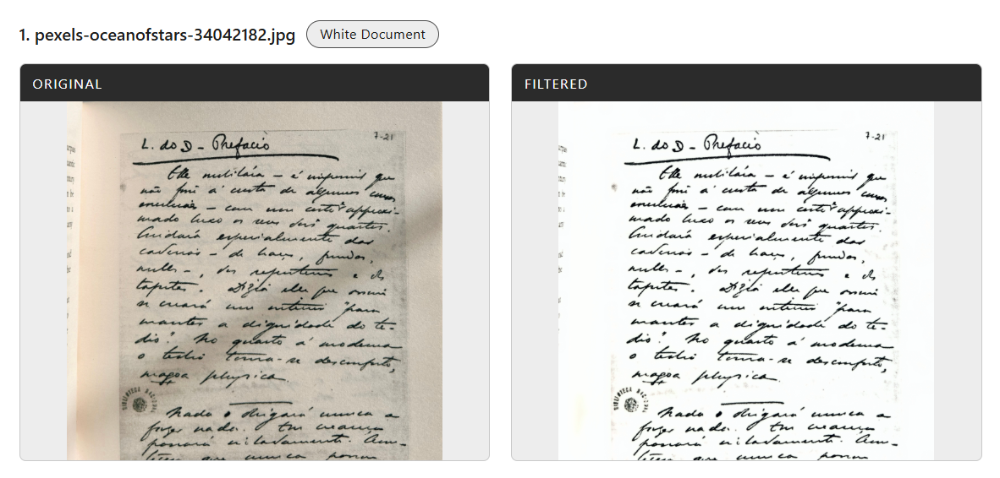
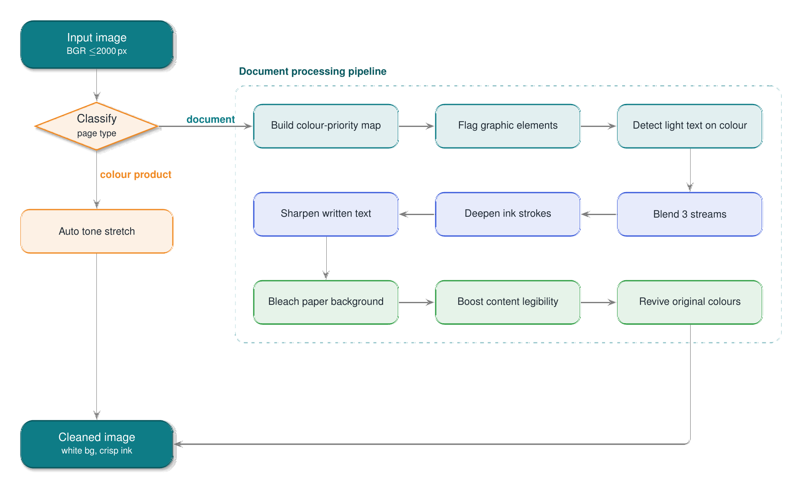

# Crispen — Automatic Document Colour Filter (no ML)

> A classical **computer-vision** document clean-up tool. Give it a photographed
> or scanned page and it returns a crisp, **pure-white-background** copy while
> keeping genuine colour (logos, stamps, buttons, photos) untouched — with
> **zero machine learning**: no models, no training, no GPU. Just OpenCV +
> NumPy image processing.

**Keywords:** automatic document colour filter · document image enhancement ·
scanned page clean-up · background whitening / bleaching · shadow removal ·
adaptive thresholding · OpenCV · NumPy · pure algorithm (no ML / no deep
learning) · Flask.

**What it does**

- **Classifies** each page (plain document vs. colourful product) from the
  pixels alone — no training data.
- **Whitens the paper** to pure white and removes uneven lighting / shadows.
- **Deepens and sharpens** faded grey ink so text stays legible.
- **Protects real colour** (logos, stamps, buttons, photos) from being wiped.

Everything is deterministic classical image processing (LAB/HSV colour work,
CLAHE, guided filtering, adaptive thresholds, morphology) — so results are
repeatable and it runs on CPU with no model files.

The heart of the project is the **algorithm** (`crispen_engine.py`); it also
ships with a small **web app** so you can try it in a browser right away.

---

## Try it (web UI)

> **Input requirement:** feed it a **pre-cropped document image** — just the
> page itself, with the surrounding background/edges already trimmed off.
> Crispen cleans the page; it does not detect or crop the page for you.

```bash
pip install -r requirements.txt
python app.py
```

Open <http://127.0.0.1:5000>, choose **one or more** images, and hit
**Crispen it**. Each image comes back as its own Original ↔ Filtered comparison
with a download link.

<p align="center">
  
</p>

*Above: a photographed handwritten page — the uneven, greyed paper is bleached
to a clean white background while the handwriting is deepened and sharpened.*

> Source photo: [pexels-oceanofstars-34042182](https://www.pexels.com/) — via
> [Pexels](https://www.pexels.com/) (free to use).

---

## How it works (the algorithm)

Crispen is a **content-aware** pipeline: instead of one global filter, it first
**classifies** the page, then routes it through the matching path — a colour
product gets a simple tone stretch, while a document goes through the full
protection pipeline steered by a per-pixel **colour-priority map**.

<p align="center">
  
</p>

Techniques used throughout: **guided filtering** (edge-aware mask smoothing,
with a Gaussian fallback), CLAHE, adaptive Canny/threshold, connected-components,
multi-scale texture variance, and NaN/Inf guarding on every risky operation.

The public entry point returns the result **and** every intermediate stage:

```python
cleaned, stages = CrispenEngine(auto_detect=True).run(bgr_image)
# stages: priority map, per-region masks, each pass' frame, detected category...
```

---

## Use the engine as a library

The engine has **no web/UI dependency** — import it anywhere:

```python
import cv2
from crispen_engine import CrispenEngine

bgr = cv2.imread("page.jpg")
cleaned, stages = CrispenEngine(auto_detect=True).run(bgr)

print(stages["detected_type"])       # 'white_document' | 'colored_product'
cv2.imwrite("page_cleaned.png", cleaned)
```

`stages` also holds every intermediate snapshot (priority map, masks, per-pass
frames) for inspection or debugging.

---

## HTTP API

The web app also exposes a plain JSON API:

| Method | Route          | Purpose                                  |
| ------ | -------------- | ---------------------------------------- |
| `GET`  | `/`            | Serve the web UI                         |
| `POST` | `/api/filter`  | Filter one or many uploaded images       |
| `GET`  | `/api/health`  | Health check → `{"ok": true}`            |

**`POST /api/filter`** — multipart form, field name `image` (repeat it for
multiple files). Response:

```json
{
  "ok": true,
  "results": [
    {
      "ok": true,
      "filename": "scan1.png",
      "category": "white_document",
      "original": "data:image/png;base64,...",
      "result":   "data:image/png;base64,..."
    }
  ]
}
```

Each result carries its own `ok` flag, so a single bad file reports
`{"ok": false, "filename": ..., "error": ...}` without failing the whole batch.

```bash
curl -s -X POST http://127.0.0.1:5000/api/filter \
  -F "image=@page1.jpg" -F "image=@page2.png"
```

---

## Requirements

Python 3.9+. Dependencies are split into two groups in
[`requirements.txt`](requirements.txt):

| Group        | Packages                           | Needed for                                        |
| ------------ | ---------------------------------- | ------------------------------------------------- |
| **Engine**   | `opencv-python`, `numpy`, `pillow` | the image-processing engine (`crispen_engine.py`) |
| **API / UI** | `flask`                            | the Flask web app + HTTP API (`app.py`)           |

```bash
# everything (engine + web app)
pip install -r requirements.txt

# or, engine only (as a library)
pip install "opencv-python>=4.8,<5" "numpy>=1.24,<2" "pillow>=10.0,<11"
```

Verified with: OpenCV 4.12, NumPy 1.26, Pillow 10.2, Flask 3.0.

---

## Project layout

```
crispen/
├── crispen_engine.py   # THE ALGORITHM — pure OpenCV/NumPy, no web/UI, no ML
├── app.py              # Flask API + serves the web UI (demo layer)
├── templates/
│   └── index.html      # monochrome (white/black/grey) single-page UI
├── requirements.txt
└── media/
    ├── workflow.png                       # working-flow diagram
    ├── result.png                         # before/after captured from the UI
    └── pexels-oceanofstars-34042182.jpg   # source photo for the result
```

---

## Notes

- **Input must be a pre-cropped document image** — the page only, edges already
  trimmed. Crispen does not perform page detection / cropping.
- Tuned for images up to ~2000 px on the long edge; a typical page takes a few
  seconds on CPU.
- **Performance:** the pipeline is somewhat slow — it favours quality over
  speed, running many full-image filter passes. There is clear room to make it
  faster (e.g. reusing colour-space conversions, downscaling masks, or
  processing batches in parallel) without changing the output much.
- Batch images are processed sequentially.
- The UI palette is intentionally white / black / grey only.
